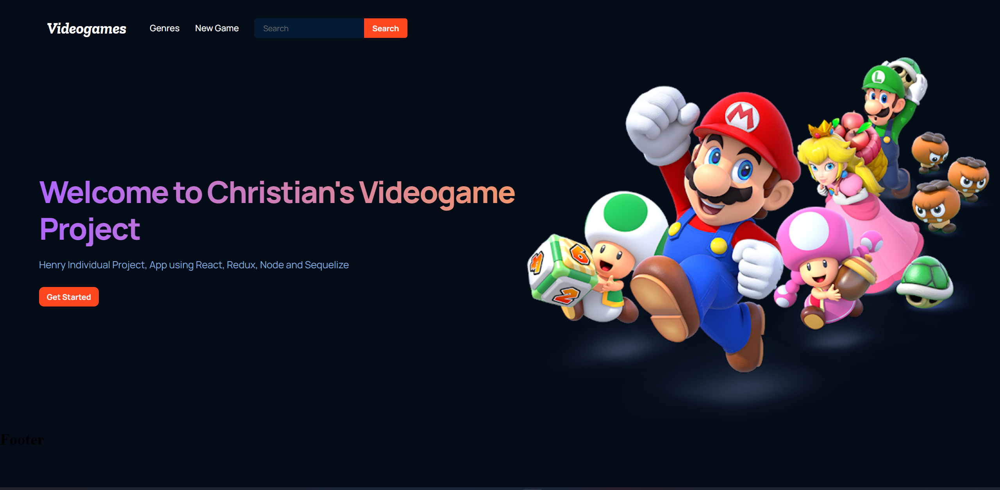
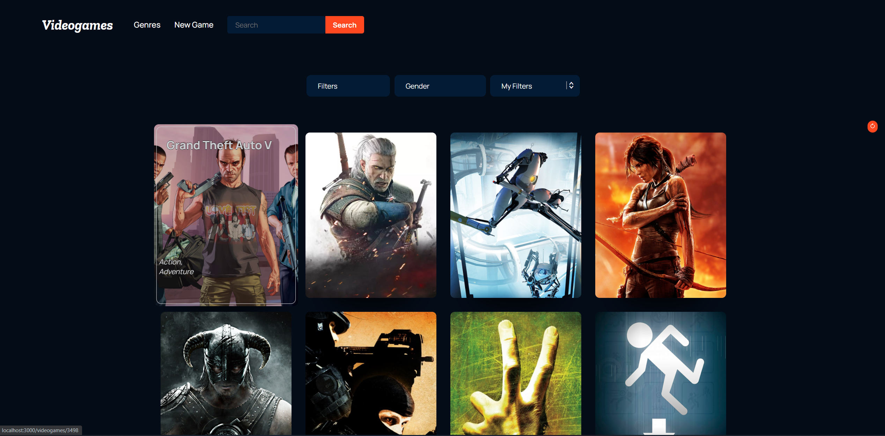
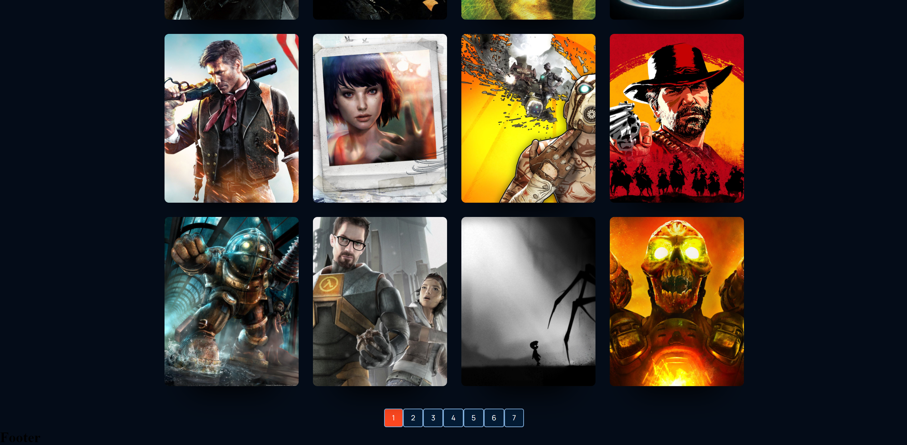
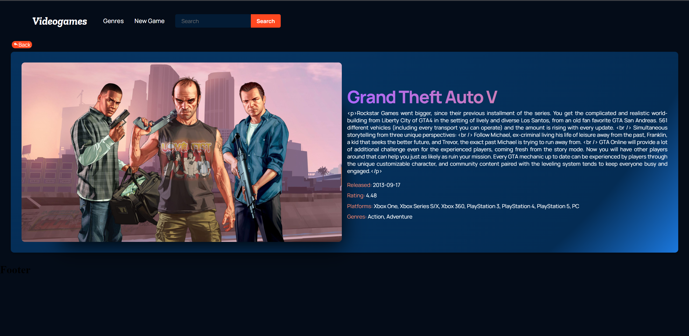
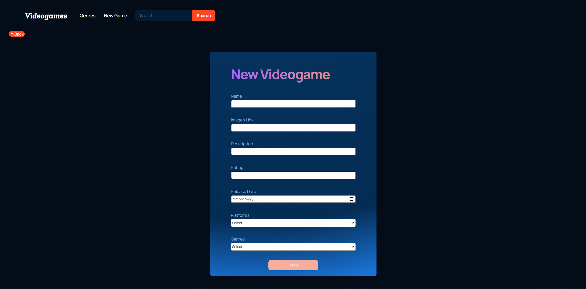

    

# Individual Project - Henry Videogames

  

## The project was built on:

- React, Redux, Node, Express y Sequelize.

# Run this proyect
You must be into the:
- /client
- /api
 
Run [NPM Install]
 
then you will need to run [NPM start] into the both directories

<h3> Check a preview here </h3>

Landing Page

Home Page

Pagination

Detail Page

Form Page

⭐️ [@c4chris124](https://github.com/c4chris124)
